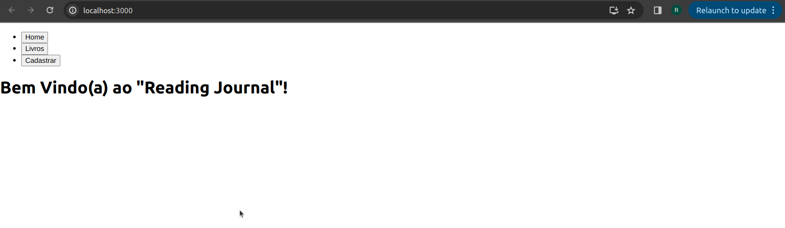
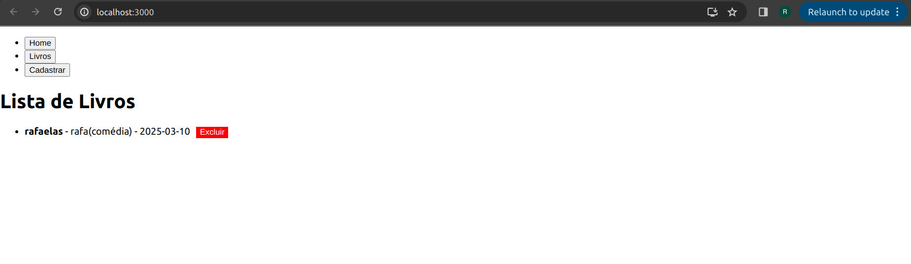
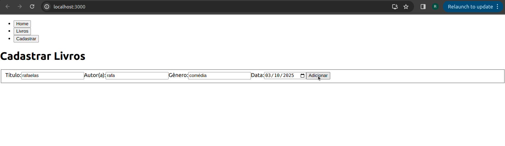

# Reading Journal Rafaela Haeser - fase 1

## Descrição do Projeto
O **Reading Journal** é uma aplicação React que permite aos usuários cadastrar, ver em lista e excluir "livros". Este projeto foi desenvolvido como parte da **Fase 1** do curso.

## Funcionalidades
✅ Cadastro de livros com título, autor(a), gênero e data  
✅ Validação de formulário com feedback visual  
✅ Listagem de livros cadastrados  
✅ Exclusão de livros com um botão de "Excluir"  
✅ Navegação dinâmica entre Home, Lista de Livros e Cadastro

## Componentes
Os componentes estão no diretório ./src/components e possuem as seguintes características:

## BookForm:
addBook: função de callback que adiciona um novo livro à lista.
O BookForm é responsável por exibir um formulário onde o usuário pode cadastrar novos livros. Ele inclui campos para Título, Autor, Gênero e Data, além de um botão para submeter o formulário.

Funcionalidades
Captura os valores inseridos pelo usuário nos campos de input.
Valida se todos os campos foram preenchidos antes de permitir o cadastro.
Aplica um feedback visual caso algum campo esteja vazio.
Chama a função addBook para adicionar o livro ao App.js.

## BookList:
books: um array contendo os livros cadastrados.
deleteBook: função de callback que remove um livro da lista.
O BookList exibe uma lista de livros cadastrados. Caso não haja nenhum livro, exibe a mensagem "Nenhum livro cadastrado.".

Funcionalidades
Lista dinamicamente todos os livros cadastrados.
Mostra Título, Autor, Gênero e Data de cada livro.
Inclui um botão "Excluir" ao lado de cada livro, permitindo a exclusão do item da lista.

## NavBar:
setActiveComponent: função que define qual componente deve ser exibido na tela.
NavBar funciona como um menu de navegação da aplicação, permitindo alternar entre as páginas de Home, Lista de Livros e Cadastro.

Funcionalidades
Utiliza botões para definir o estado ativo da aplicação.
Permite alternar dinamicamente entre os componentes.

## Conclusão:
Este projeto foi desenvolvido para demonstrar o uso de ReactJS, incluindo componentização, estados (useState), manipulação de eventos (onClick, onChange, onSubmit) e passagem de props.

## Futuras melhorias:

Implementar uma funcionalidade de edição de livros.
Melhorar o design utilizando CSS ou Bootstrap.
Adicionar armazenamento local para manter os livros salvos ao recarregar a página.

## PARA EXECUTAR O PROJETO:

1️⃣ Abra o terminal e entre na pasta do projeto:
cd rafaela_haeser-projeto-fase-1

2️⃣ Instale as dependências:
npm install

3️⃣ Execute o projeto:
npm start

O projeto será iniciado automaticamente no navegador em http://localhost:3000.

Aqui estão algumas capturas de tela mostrando o funcionamento do projeto:

Tela Inicial (Home)

Lista de Livros

Cadastro de Livro
